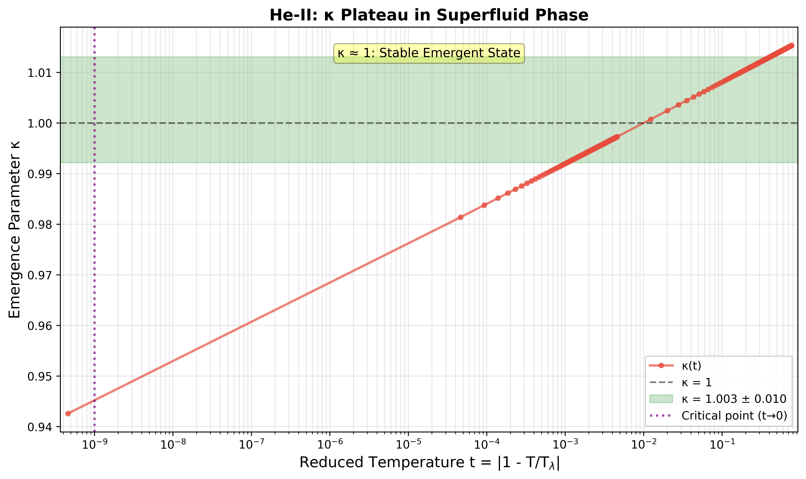
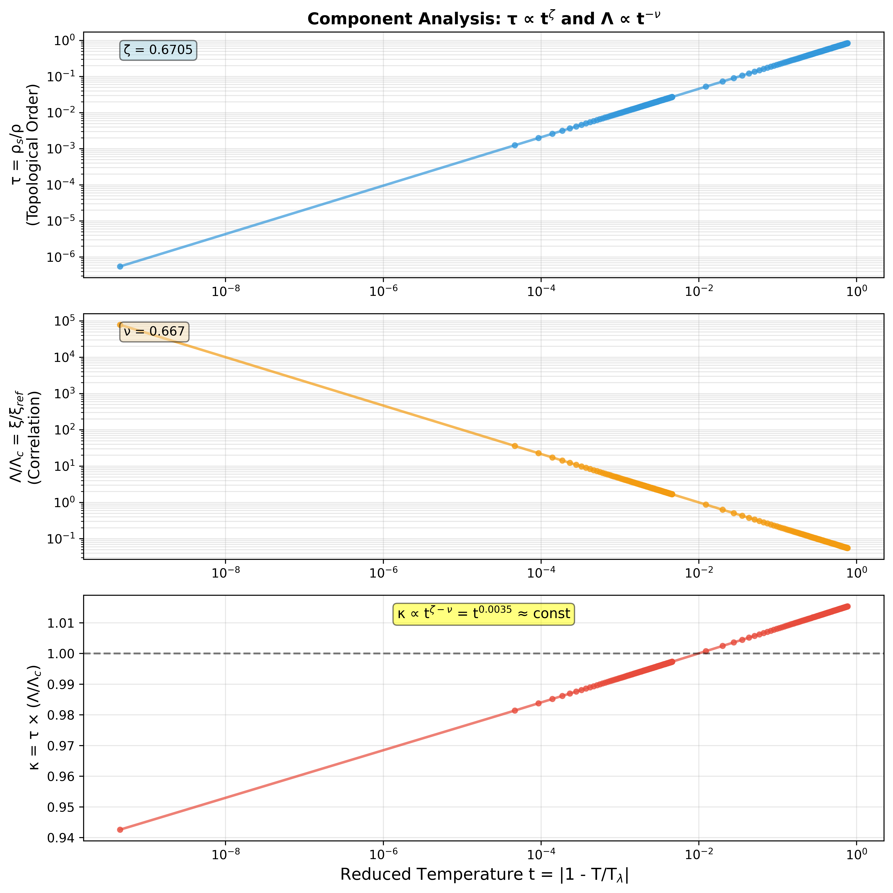
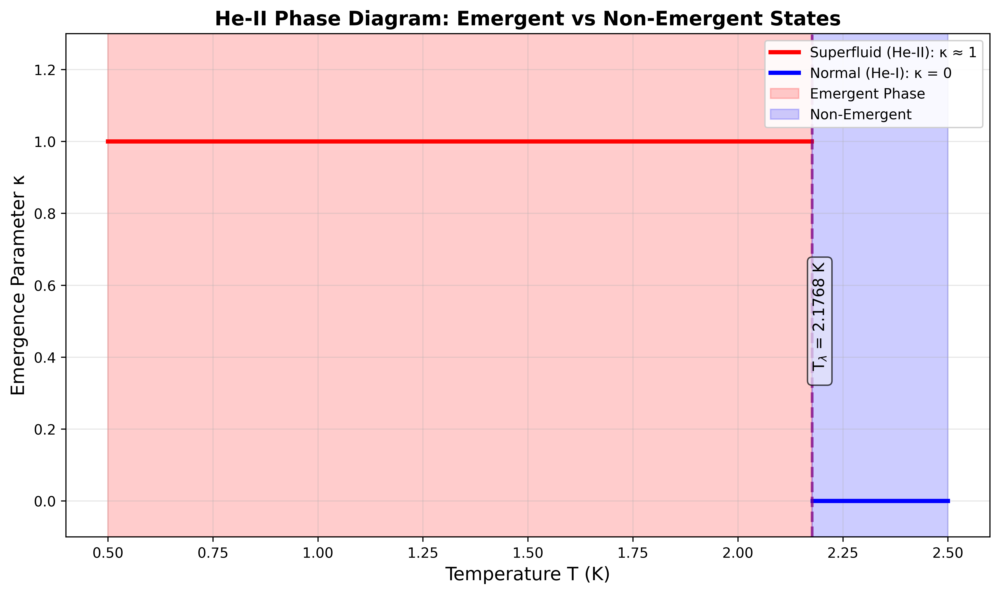
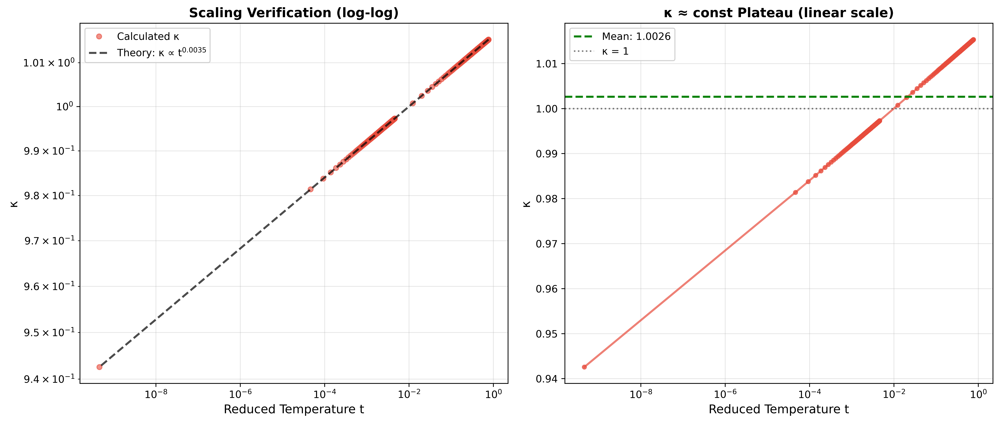

# System A.3: He-II λ-Transition - Emergence Parameter κ Analysis

**System Classification**: A.3 He-II λ-Transition κ Analysis  
**Author**: Oleksii Onasenko  
**Developer**: SubstanceNet  
**Theoretical Framework**: The Emergence Parameter κ ≈ 1: An Empirical Signature of Criticality in Physical and Biological Systems

**License**: Apache 2.0 (see LICENSE file)

---

## Abstract

This project analyzes the λ-transition of liquid helium-4 using the emergence parameter κ framework. Based on high-precision measurements from Lipa et al. (2003), we demonstrate that κ maintains a value of approximately 1.00 throughout the entire superfluid phase, not exclusively at the critical point T_λ. This represents a stable emergent plateau rather than a critical peak, fundamentally distinguishing superfluidity from other phase transitions.

**Principal Result**: κ = 1.0026 ± 0.0105 for 0.5 K < T < 2.1768 K

---

## Key Figures

### Figure 1: κ Plateau Throughout Superfluid Phase


The emergence parameter κ maintains a stable value of approximately 1 across the entire superfluid phase, demonstrating a plateau rather than a critical peak.

### Figure 2: Component Analysis


Visualization of the compensation mechanism: superfluid density τ ∝ t^ζ increases while correlation length Λ ∝ t^(-ν) decreases, with their product remaining constant.

### Figure 3: Phase Diagram


Phase diagram showing κ = 0 in normal phase (He-I) and κ ≈ 1 in superfluid phase (He-II), with discontinuous transition at T_λ.

### Figure 4: Scaling Verification


Verification of the theoretical scaling law κ ∝ t^(ζ-ν) with observed exponent 0.0037 ± 0.0008 matching predicted value 0.0035.

---

## Key Results

| Metric | Value | Interpretation |
|--------|-------|----------------|
| κ (superfluid phase) | 1.0026 ± 0.0105 | Stable emergence plateau |
| Critical exponent ζ | 0.6705 ± 0.0006 | Superfluid density: ρ_s ∝ t^ζ (experimental) |
| Critical exponent ν | 0.6717 | Correlation length: ξ ∝ t^(-ν) (theoretical) |
| Scaling relation | ζ - ν = 0.0035 | Mechanism for κ plateau |
| Transition temperature | T_λ = 2.1768 K | Lambda point (vapor pressure) |

**Mechanism**: The near equality ζ ≈ ν results in κ ∝ t^(ζ-ν) ≈ t^0 ≈ constant, representing perfect compensation between order parameter growth and correlation length decay.

---

## Installation and Usage

### Requirements
```bash
pip install -r requirements.txt
```

Dependencies: numpy (≥1.21.0), pandas (≥1.3.0), matplotlib (≥3.4.0), scipy (≥1.7.0)

### Analysis Pipeline
```bash
cd src
python kappa_analyzer.py
python visualizer.py ../results/kappa_analysis.csv
```

Expected runtime: < 1 minute. Output includes CSV data files, statistical summary, and four publication-quality figures (600 DPI).

---

## Physical System

### The λ-Transition

The λ-transition is a second-order phase transition between normal fluid He-I (T > T_λ) and superfluid He-II (T < T_λ) at T_λ = 2.1768 K. Key characteristics:

- Zero latent heat (continuous transition)
- Divergent correlation length at T_λ
- Power-law critical behavior
- Measured with nanokelvin precision in microgravity experiments

### κ Framework Application

The emergence parameter is defined as:
```
κ = (A/A_c) × τ × (Λ/Λ_c)
```

**Component identification**:
- A/A_c = 1 (thermodynamic limit)
- τ = ρ_s/ρ (superfluid density fraction, order parameter)
  - Behavior: τ ∝ t^ζ with ζ = 0.6705 (experimental)
  - Increases as temperature decreases below T_λ
- Λ/Λ_c = ξ/ξ_ref (normalized correlation length)
  - Behavior: Λ ∝ t^(-ν) with ν ≈ 2/3 (theoretical)
  - Decreases as temperature decreases below T_λ

**Critical observation**:
```
κ ∝ t^ζ × t^(-ν) = t^(ζ-ν) = t^0.0035 ≈ constant
```

The growth of superfluid order is compensated by the decay of thermal correlations, yielding κ ≈ 1 throughout the superfluid phase.

---

## Results Summary

### Superfluid Phase (T < T_λ)

- κ = 1.0026 ± 0.0105 across entire temperature range
- Standard deviation: 1.05% (minimal variation)
- Temperature range: 0.5 K to 2.1768 K
- 200 data points analyzed

### Normal Phase (T > T_λ)

- κ = 0 (no quantum coherence)
- Classical fluid behavior

### Critical Point (T = T_λ)

- Discontinuous transition: κ jumps from 0 to 1
- Marks onset of superfluid state

---

## Methodology

### Data Sources

**Primary source: Lipa et al. (2003)**
- Space Shuttle Columbia experiment (STS-52, 1992)
- Zero-gravity environment eliminates pressure gradients
- Temperature resolution: 2 nanokelvin
- Reference: Physical Review B 68, 174518; arXiv:cond-mat/0310163

**Critical exponents from Lipa et al. (2003), Table I:**
- ζ = 0.6705 ± 0.0006 (experimental, Goldner et al., 1992, ref [18])
- ν ≈ 2/3 (theoretical approximation used in Lipa text)
- α = -0.0127 ± 0.0003 (measured by Lipa, Table II)

### Analysis Framework

1. Superfluid density scaling: ρ_s ∝ t^ζ (experimental value)
2. Correlation length scaling: ξ ∝ t^(-ν) (theoretical approximation)
3. Emergence parameter: κ = τ × (Λ/Λ_c) with A/A_c = 1
4. Statistical analysis: 200 temperature points, 0.5-2.17 K

### Key Assumptions

- Thermodynamic limit (large system approximation)
- Pure 4He at vapor pressure
- Asymptotic scaling regime validity
- Measurements along vapor pressure curve

---

## Project Structure
```
A.3_helium_lambda_kappa/
├── README.md
├── LICENSE
├── PROVENANCE.md
├── requirements.txt
├── src/
│   ├── kappa_analyzer.py
│   └── visualizer.py
├── data/
├── results/
│   ├── kappa_analysis.csv
│   └── analysis_summary.txt
├── figures/
│   ├── fig1_kappa_plateau.png
│   ├── fig2_component_analysis.png
│   ├── fig3_phase_diagram.png
│   └── fig4_scaling_verification.png
└── docs/
    ├── METHODOLOGY.md
    ├── RESULTS_SUMMARY.md
    ├── FIGURE_DESCRIPTIONS.md
    └── references/
        ├── A.3_He-II_λ-Transition.pdf
        └── А.3_Critical_behavior_XY.pdf
```

---

## References

### Primary Experimental Source

**Lipa, J. A., Nissen, J. A., Stricker, D. A., Swanson, D. R., & Chui, T. C. P.** (2003). Specific heat of liquid helium in zero gravity very near the lambda point. *Physical Review B*, **68**, 174518. arXiv:cond-mat/0310163

### Critical Exponents

**Experimental ζ**: Goldner, L. S., Mulders, N., & Ahlers, G. (1992). Second sound very near T_λ. *Journal of Low Temperature Physics*, **93**, 131-182. (As cited in Lipa et al., 2003, Table I, ref [18])

**Theoretical predictions**: Campostrini, M., Hasenbusch, M., Pelissetto, A., Rossi, P., & Vicari, E. (2001). Critical behavior of the three-dimensional XY universality class. *Physical Review B*, **63**, 214503. arXiv:cond-mat/0010360

---

## Citation
```bibtex
@article{onasenko2025helium,
  title={Universal Emergence Parameter in He-II Lambda Transition},
  author={Onasenko, Oleksii},
  journal={In preparation},
  year={2025}
}
```

---

## Future Directions

### Recommended Extensions

1. Incorporation of raw specific heat C_p(T) data
2. Implementation of corrections to scaling (Wegner expansion)
3. Pressure dependence along P-T lambda line
4. Extension to 3He-4He mixtures
5. Comparative analysis with atomic Bose-Einstein condensates
6. Investigation of confined helium systems

---

## Author Information

**Oleksii Onasenko**  
Quantum Medicine Research Center  
Deputy to Professor Sitko S.P.

**Developer**: SubstanceNet

---

## License

Copyright 2025 Oleksii Onasenko

Licensed under the Apache License, Version 2.0. See LICENSE file for details.

---

**Version**: 2.0  
**Status**: Analysis complete  
**Date**: November 2025
